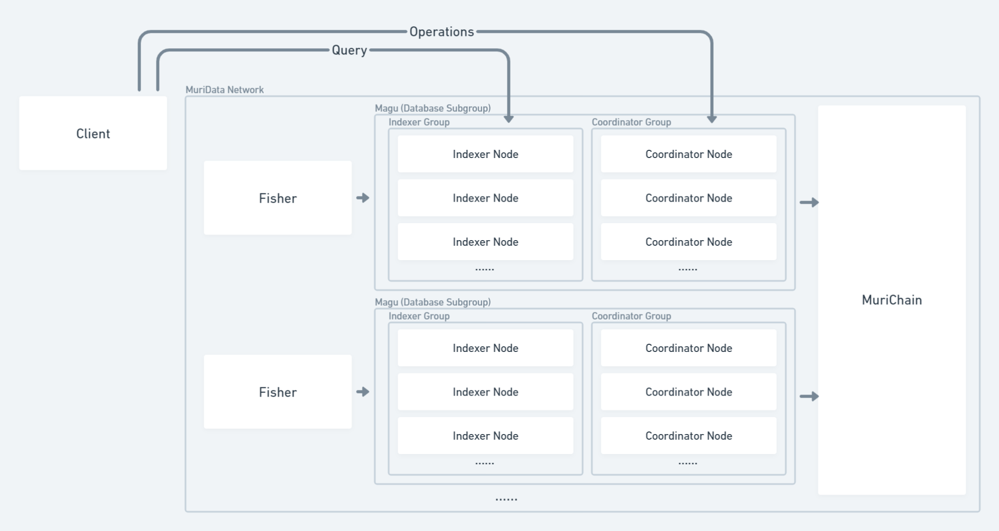

# MuriData: A Decentralized Retrievable Database based on Blockchain

## Abstract

## Introduction

Blockchain now offers an ability for decentralized systems to reach a consensus among various nodes in peer-to-peer networks. Recent technological advances in blockchain systems have enabled them to perform Turing-complete computations, this ability also known as 'smart contract'. In now-operating blockchain projects such as Ethereum (ETH), smart contracts play many vital roles in managing the state of the chain by handling transactions. Even recently proposed hypothetical projects adapted many solutions to allow the execution of computationally intensive contracts. Therefore, Blockchain can be a permissionless platform of cloud computing where clients and service providers can exchange their computation resources freely and economically.

However, blockchain is still weak at performing some specific computational tasks. Task such as querying a large database is difficult to implement using existing blockchain technologies because of the following aspects:

1. Blockchain itself is not very scalable. Scalability means that the number of tasks the whole network can deal with increases as the number of nodes increases. This is because that every node needs to execute the same program to achieve the same global state and reject malicious transactions. Querying and searching need real-timing and speed, but blockchain can not really achieve this, so we need to design a mechanism that does not need many on-chain resources. One way to increase the scalability of the system is to execute heavy tasks off-chain, and verify the results on-chain.
2. Querying tasks are storage-intensive, which means they rely heavily upon both storage capacity and transferring speed of data. Previous designs for executing computationally heavy programs often assume the inputs of the program are small. But, querying is executed on a large database, so nodes must store all data. To offer higher speed, nodes must have higher bandwidth. This would contradict the goal of being scalable and decentralized. Therefore, designs of executing computationally intensive programs can not be totally appliable to such a system.
3. The correctness of querying results is hard to prove. In a decentralized system where there is no trust node, proving the correctness of query results is especially challenging. Nodes who perform query tasks have to prove that their results are truly in the database and are what the client is asking for. Again, in previous designs, nodes can prove the correctness of their execution by either repeating the execution in other nodes or showing proof of the correctness of their execution. However, repeating the query is really a waste of resources and at the expense of scalability, and it is hard to show proof for results from a large database. 

In many situations, given a query input, applications often need to search the right data in a database. With large amount of data, Indexes are used to speed up the querying process. Decentralized applications (dapp) can utilize this ability and become more user-friendly. They could allow users to query for a certain post in their network, or get recommended contents.

In this paper, we propose a complete solution for building a Decentralized Retrievable Database in a decentralized network using blockchain technology, named MuriData. To provide practicality and operability, this system should have the following properties:

1. ***Robust***: Our system should work under a network having both Rational, Byzantine, and Quasi-honest nodes. Byzantine nodes may perform malicious behavior by trying to damage the network without considering the cost, while Quasi-honest nodes may use the results from other nodes to respond to the network, also known as a "free-loading attack". Also, there may be some selfish nodes who save their resources by performing different than normal behavior, and we consider them Quasi-honest nodes. This model is relatively realistic thus providing a useful guideline in designing a robust system.
2. ***Scalability***: Our system is designed to support the query for a billion levels of documents per database, which strikes the significance of scalability. To achieve this, on-chain verifications must be fewer and lighter as possible, while off-chain executions must be able to be executed in parallel and scale as the number of nodes increases.
3. ***Availability***: In a permissionless network where nodes could join and exit freely, the data must be constantly online so that the system can perform tasks normally. To ensure the availability of our network, we should first ensure the data is always available.
4. ***Properly Designed Reward and Punishment System***: Nodes should be rewarded as they work as intended and be punished when they try to cheat. This system must be fair when analyzed using game theory. A nash equilibrium must exist when nodes behave properly.

To achieve these goals, we proposed the MuriData protocol, which describes how the data is indexed and queried in a decentralized system.

In MuriData protocol, nodes who want to become **Indexer** or **Coordinator** will first register on the chain with an arbitrary amount of token staked in proportion with the level of **Service License Agreement** (**SLA**) they committed. They will then get permission to index one database, forming groups of nodes that deal with incoming queries and operations. The coordinator is responsible for the incoming operations on the whole database and generates the **Merkle Root** of this database called **Snapshot**. The indexer will handle all incoming queries with **Conditional Payment**, and generate results with **Merkle Proof** indicating the existence of the record. The **Fisher** will observe the results from Indexers and create a dispute for an incorrect result.

We will explain this mechanism in-depth and with detailed analysis, showing its feasibility in such a decentralized database system.

## Literature Review

### Blockchain Overview

In his first paper [Bitcoin: A Peer-to-Peer Electronic Cash System](https://bitcoin.org/bitcoin.pdf), Satoshi Nakamoto proposed the blockchain, which came to be the most influential innovation in the decentralized system. In his tentative plan, transactions can be organized into blocks, which then are linked together by hash pointers to form a chain called Blockchain. With such an innovative data structure, nodes in a decentralized system can reach a global consensus with final consistency.

This system is especially useful when it comes to electronic cash systems. Many great peer-to-peer cryptocurrencies including Bitcoin came from blockchains, such as Litecoin, Monero, and Ethereum. The following cryptocurrencies adopted new mechanisms or changed the original design of Bitcoin to accomplish more complicated tasks. Monero, for example, made transactions anonymous, blocking the chance to know the origin and destination of any transaction, and in Ethereum, Turing-complete codes can be executed online to support more types of contracts, Ethereum thus gaining unprecedented flexibility in dealing with different tasks.

Nevertheless, Ethereum is criticized for its high cost and low speed. To protect nodes from the attack of Denial of Service (DoS), Ethereum charges fees (GAS) to users for executing smart contracts. As the miners spend most time solving the Proof of Work (POW) puzzle to produce blocks, the number of transactions the network can handle in a given time is largely limited, so the transactions must include higher fees to be included in the blocks by miners. The Transaction Per Second (TPS) of Ethereum is so low that when one prevalent DApp called CryptoKitties was released, the network was in congestion.

Recent advances aim to solve this problem by either improving the Layer 1 (Blockchain) or developing the Layer 2 mechanism. These Layer 1 improvements include changing the consensus mechanism and structure of chains. For example, the Polygon uses Proof of Stake (POS) to speed up the block-producing process, and Ethereum 2.0 uses Sharding to increase network scalability. On the other hand, Layer 2 improvements focus on building an extra layer on top of the blockchain to support more transactions and operations, such as the Lighting network, Optimistic Rollup, and Zero-Knowledge Rollup.

Layer 1 improvements change the blockchain consensus mechanism. Sharding, for example, splits one chain into many shard chains and assigns each chain to a different block producer. These Layer 1 modifications often sacrifice security in exchange for speed and scalability. Layer 2 advancements, on the other hand, can benefits the blockchain system without compromise. They have the Layer 1 blockchain to be their backend which ensure its validity and security. They also adopt some mechanism to increase their scalability. For example, the Zero-Knowledge Rollup uses zero-knowledge proofs to prove the validity of the state transition. It takes shorter time to verify the zero-knowledge than to execute the state transition. Therefore the heavy work could be done by the block producer, then anyone could easily verify it.

### Database Overview

Databases have played many vital roles in the Web 2 era. It is reasonable to predict its importance in the Web 3 era. 

### Zero-Knowledge Overview

## Design

### Network

There are four types of nodes that will participate in the network: Coordinator, Indexer, Fisher and Validator.

#### Coordinator

The coordinator is crucial in managing the state of one database. As coordinators receive Operation from clients, they execute the State Transition Function and modify the state of the database. After several Operations are executed, they will be chosen to take a SnapShot of the state of the database and generate proof about the correctness of state transition. The proof is used to update the on-chain database state and any data will be available for query after the snapshot. They are rewarded for producing snapshots.

One database may have many corresponding Coordinators to ensure liveness. Clients may choose to send their operations to any of these Coordinators based on lantency or price. Each operation need to be signed and cost gases, which prevent Coordinator to maliciously manipulate the database.

#### Indexer

The Indexer will deal with any incoming query. Indexers must synchronize with the state of database constantly and execute query under the newest snapshot of database. The query will firstly be validated, and executed in the aid of indexes, then the result is sent back to the client. The result is proved by Merkle Proof, and its correctness can be challenged by Fisher.

#### Fisher

Fishers will observe any result sent from the Indexer. By re-executing the query, they can determine whether the Indexer is loafing on the job and submit evidence on the chain. They play a vital role in ensuring the Indexers are always honest.

### Validator

Validators are only responsible for producing blocks. The consensus mechanism of the chain has no relation with databases. It could be Proof of Stake or other variants.

### Mechanism

#### Database

Simply put, database can be considered as a finite Set, and every line of data can be seen as a item in the set. Query is the process by which a Pattern(query) is provided so that matched items from the Set could be selected. We can describe the process in mathmetical form:

Database is a set of items: $DB = \{d_1, d_2, d_3, ... , d_n\}$
Query is a pattern input: $Q$
There must be a funtion that calculate the degree of match between a given item in database and the query: $S(d_x, Q)$
Smaller $S(d_x, Q)$ indicates that the $d_x$ is more likely to be the result of $Q$
So the result of query is a set of sorted items $R = \{d_{a1}, d_{a2}, d_{a3}, ... , d_{an}\}$ where $sim(d_{a1}, d_{input}) > sim(d_{a2}, d_{input}) ... > sim(d_{an}, d_{input})$ and $d_an \in DB$

This definition is applicable to two types of databases query: **Nearest Neighbor Search** and **Exact Search**.
**Nearest Neighbor Search** is to select a set of result that is sorted by the similarity between query and items.
**Exact Search** is to select a set of result that all items in the result set is the **Exact Match** of the query.
When $S(d_x, Q) = 0$, we call the item $d_x$ to be the **Exact Match** of the query $Q$.
Indexing can help the query executor to quickly obtain the result $R$ without the need to compare each item to the query using similarity function $S$.

This definition of database is extremely useful when designing the query validation mechanism. 

#### Operation Validation

All the incoming operations should modify the state of database. This include Addition, Modification, and Deletion. These actions can be validated by others if they execute the same operations and get the same result. And because each operation is emitted by a client, it is possible that there may be malicious operations. The design of Operation Validation should be fast and tolerant to attacks.

As the incoming operations is dealt by Coordinators, the cost of validate the operation by others can be greatly reduced if the Zero-Knowledge proof system is used. Coordinators can generate proofs about the validity of operations, and other nodes can verify with little expense.

The operation must be checked by a *pre-defined set of rules* called **Access Controller** which is written in Zero-Knowledge circuits to generate zk proofs for operations. Access Controller will check for the validity of data structure, the account who initiate the operation, and also the existence of an item in the database.

The Operation must cost gases. Without cost it will be easier to perform Denial-of-Service attack and flood the database with trash data. The Operation requests must contain conditional payment to pay for the Indexer nodes and Coordinator nodes.

Operations that contain a large amount of data are not stored directly on-chain. Instead, they are stored on other decentralized file systems, and only a hash pointer will be stored. Because the hash pointer is calculated from the content, any properties of the content can be proved using zk-proofs. In this way, the availablilty of data source can not be ensured. Therefore, Indexers and Coordinators should be able to fetch data from each other with some fee.

#### Database Snapshot

With the zero-knowledge proof validating the Operation, it is possible to update the database using zk proofs which indicates a correct state transition just like ZK-Rollup in ethererum. The whole database is a Merkle Trie, which is also the data structure used by Ethereum to store state. 

The Merkle Trie has three features that makes it ideal to represent the database:
1. It can represent key-value pairs with infinite length.
2. The sequence of insert operations does not affact the final root.
3. Merkle Proof can be generated to proof the existence of one key.

On-chain, only the root of the merkle tree is stored, while the Indexers and Coordinators store the whole tree so that they are able to generate state transition proofs and merkle proofs.

The state transition proof is a zero-knowledge proof. It proves the correctness of several operations in sequence, therefore it can prove that the next merkle root can be gained from previous root with the execution of these operations. The zero-knowledge proof is used to minimize the storage and computation cost of the whole network. This state transition proof is similar to the proof used in ZK-Rollup but with merkle prefix tree.

For certain period blocktime, one Coordinator will be choosed to generate a new state for the database, which is called Snapshot. Random rotation of Coordinators allows every Coordinator to be incentivied.

#### Query Process

##### Result Validation

To check that the Indexers are operating properly, the result must be proved to be effective. There are two steps check :

1. The result item is in the database.
2. The result must be the optimal (there is no other items in the database that have more similarity than the result item).

The first check is accomplished by Merkle Proof to prove the existence of the item in the current database snapshot.

The second check is finished by the Fishers. Fishers are responsible for checking whether the query and result have the largest similarity in the whole database. If they find more similar record in a database, they could create a dispute which contains the more similar result. Force Error may be implemented to incentivise them.

##### Conditional Payment & Discount Mechanism

In MuriData network, the client must directly contact with Indexers to send query and get results. A payment is required to pay for the query fee and prevent Denial-of-Service attack to Indexer nodes. But, both parties may be malicious and ready to cheat others. From the client side, it does not want to pay for the fee or even attack the Indexer to make its works unnecessary. For the indexer, it may try to cheat by providing a fake answer. To solve this, **Conditional Payment** and **Discount Mechanism** is needed.

The **Conditional Payment** is a small amount of locked money that only by providing the result of query could the Indexers unlock it and get the fee. This ensures that the Indexer must get the result to unlock it. However, the Indexer can also choose not to send back the result, and directly pack their results on-chain to claim their rewards.

The **Discount Mechanism** is devised so that clients and Indexers reach a nash equilibrium when Indexers sends the result back to the client. It guarantees that rational Indexers and clients will cooperate to finish the whole process. when the result generated by the Indexers is also signed by the client, the fee of this query is reduced, which means that the cost is lower and reward is higher. This will drive Indexers to actively send result back to client, and client sign it and send it back to the Indexer. This mechanism can also be called **Result Confirmation**.

#### Slashing

All cheating behaviors of both Coordinator, Indexer and Fisher will result in slashing. In this situation, a portion of or the whole token staked by them is burned, and they lose their rewards.

For coordinator, incorrect snapshot and offline will result in slashing. For Indexers, offline and incorrect result can cause slashing. Also, if Fishers create a dispute on a valid result, they will be slashed.

## Analysis

In progress...